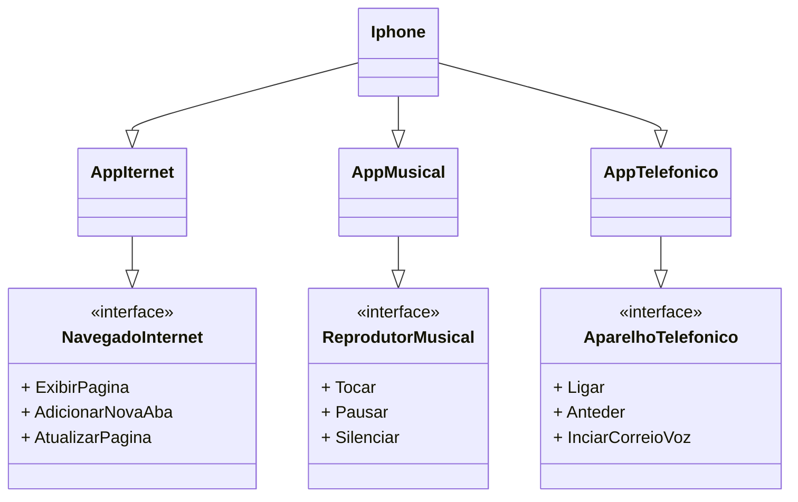

## Diagrama de Classes

```mermaid


classDiagram

class Iphone{  
      
  }

 class AppIternet{
 }

 class AppMusical{
 }

 class AppTelefonico{
 }


  class ReprodutorMusical{
       <<interface>>
    + Tocar
    + Pausar
    + Silenciar   
  }

  class AparelhoTelefonico{
       <<interface>>
    + Ligar
    + Anteder
    + InciarCorreioVoz    
  }

 class NavegadoInternet{
       <<interface>>
    + ExibirPagina
    + AdicionarNovaAba
    + AtualizarPagina	
 }

AppIternet--|>NavegadoInternet
AppMusical--|>ReprodutorMusical
AppTelefonico--|>AparelhoTelefonico


Iphone--|>AppIternet
Iphone--|>AppMusical
Iphone--|>AppTelefonico


```
